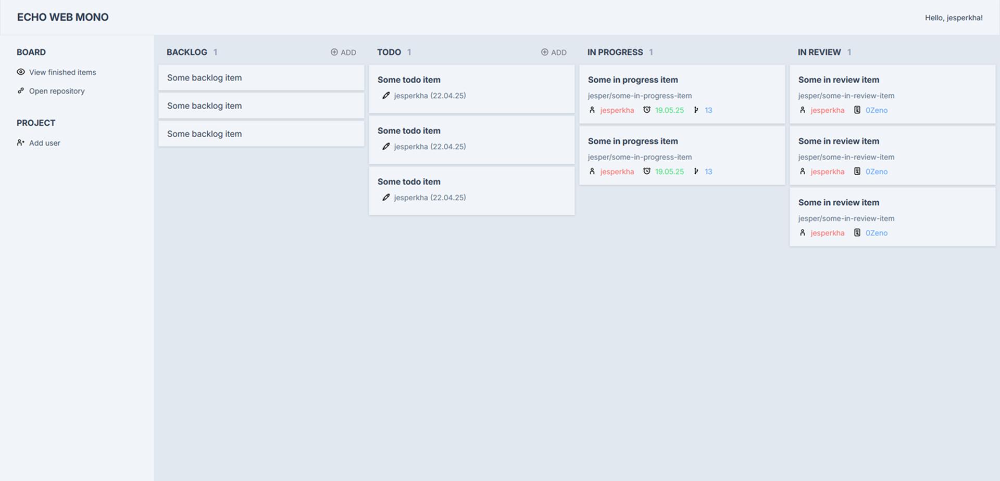
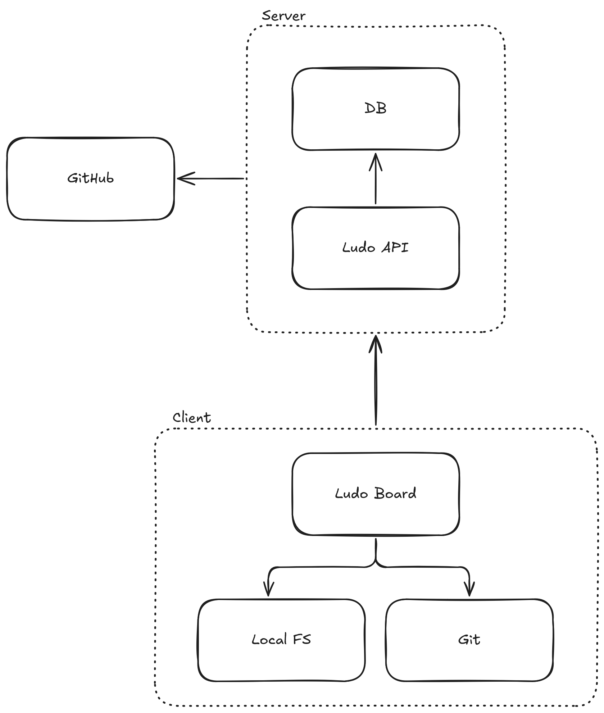

<div align="center">


<b>Simplified project management</b>

Ludo aims to put all of your project planning needs in one place and lets <br>you add your own views and boards with minimal friction using its API.

<br>



<br>

</div>

## About

### What makes Ludo special?

The problem with most, if not all, todo apps and kanban boards is that you have to spend time moving items around and manually updating the board. Ludo uses automation to make your life easier.

In the default Kanban board, items are moved automatically based on the stage of development. Items in 'In Progress' are automatically moved to 'In Review' when Ludo sees that a pull request has been opened on that branch. Then, when the pull request is merged, the item is put in 'Done'.

## Run

```sh
# Run board

cd board
go run cmd/main.go
```

```sh
# Run api

cd api
cenv fix
go run cmd/main.go
```

## Architecture

Ludo has a central API which handles interacting with the database and GitHub. The API is meant to be a generic tool to create different kinds of project management applications, or _boards_. Ludo only assigns basic relations between models such as items and boards, and allowes the board client to determine how everything should work.

The API is also designed to be easily self-hosteable using a SQLite backend.

<div align="center">



</div>

### Project structure

- `/board`:
  - `/cmd`: Entry point
  - `/config`: Board client configuration
  - `/server`: Mounting of endpoints/boards
  - `/service`: Service for interacting with Ludo API
  - `/git`: Service for local git actions
- `/api`:
  - `/cmd`: Entry point
  - `/config`: API configuration
  - `/server`: Mounting of endpoints
  - `/service`: Service for Ludo actions
  - `/database`: Database repo for queries and models
  - `/github`: Service for interacting with the GitHub API
