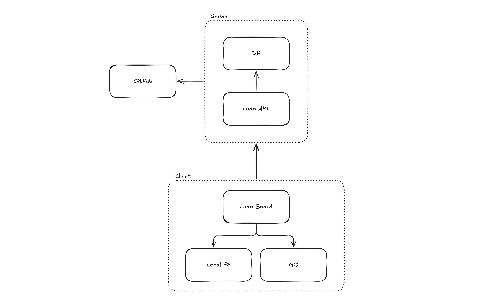

<div align="center">

<h1>Ludo</h1>


</div>

<br>

## Run

```sh
# Run board

cd board
go run cmd/main.go
```

```sh
# Run api

cd api
cenv fix
go run cmd/main.go
```

## Architecture

Ludo has a central API which handles interacting with the database and GitHub. The API is meant to be a generic tool to create different kinds of project management applications, or _boards_. Ludo only assigns basic relations between models such as items and boards, and allowes the board client to determine how everything should work.

The API is also designed to be easily self-hostable using a SQLite backend.

<div align="center">



</div>

### Project structure

- `/board`:
  - `/cmd`: Entry point
  - `/config`: Board client configuration
  - `/server`: Mounting of endpoints/boards
  - `/service`: Service for interacting with Ludo API
  - `/git`: Service for local git actions
- `/api`:
  - `/cmd`: Entry point
  - `/config`: API configuration
  - `/server`: Mounting of endpoints
  - `/service`: Service for Ludo actions
  - `/database`: Database repo for queries and models
  - `/github`: Service for interacting with the GitHub API
